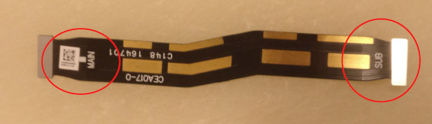

Oneplus 3T Running Hot

I destroy a fair bit of smartphones through mere coexistence. It just happens; most recently, some three weeks ago, the display cracked — _behind_ the screen protector, which was left intact. Not kidding. So, once again, I decided to replace the display; yes, on my own, I kinda got the experience. I seldom change brand or model, so I have a vast collection of more or less compatible spare parts. This time however, I was pretty sure the phone was toast after me "fixing" it. It ran hot, immediately. It would turn off with +60% on the battery, and be hot. Really hot. Also, which is my bad, I knew that I had unplugged the battery with a metal scalpel (for a man with a hammer, all problems are nails...) — with a few sparks to follow. So I was convinced this phone could not be repaired. Nonetheless I engaged in the hopeless quest to resurrect this beast, beknowing that I've previously binned a similar phone showing the same symptoms after many hours of [debugging](http://foldoc.org/debugging). This time, lo and behold, I spotted the error immediately after opening the phone; assembling the phone I had been a bit annoyed that longitudinal wires had connectors to the mainboard that aligned badly — it turns out I had turned the leftmost wire upside down. It's pure rocket science, the end marked 'MAIN' connects to the main board, whilst the end marked 'SUB' connects to the sub board. Not the other way around. Phone now assembled; works as it should. I'm happy.

Tags: smartphones, rocket-science
